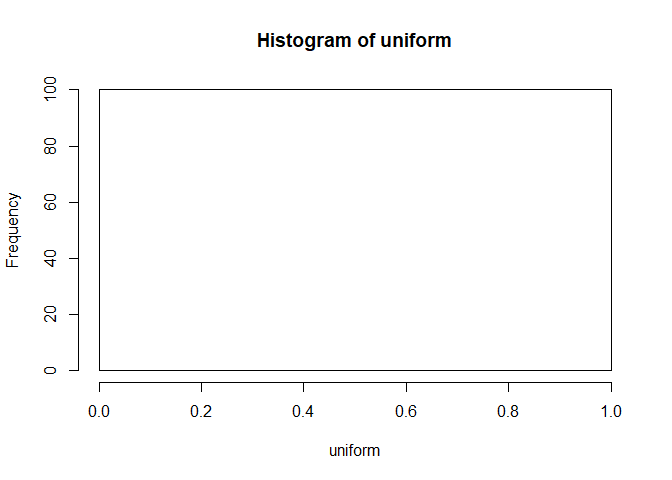

Distribution Types
================
PK (Kasidit) Ratanavijai (Master of Science in Analytics Candidate at
The University of Chicago)
10/4/2019

Note that this are my summarize of Application of Statistic. Hence, it
contains my views and comments. “ALL RIGHTS RESERVED”

## Types of Data

### **1. Discrete**

is one that can only take on a finite or countably infinite set of
values. Often these values are a subset of the integers such as male vs
female, number of coins in a wallet  
**Important discrete distribution to note.**

1.  Unifrom Distribution  
2.  Binomial Distribution  
3.  Negative Binomial Distribution  
4.  Poisson Distribution

### **2. Continuous**

can take on all values in some interval such as Height,Time  
**Important continuous distribution to note.**

1.  Exponential Distribution  
2.  Normal Distribution

### Unifrom Distribution

A discrete uniform distribution describes a random variable that takes
on a number of possible values each with equal probability. For example
a coin flip. Its pmf is a constant (where it is non-zero). A continuous
uniform distribution has a pdf that is constant on some interval.

**Example exercise**  
Q. Let X be uniform on \[0,10\]. What is P(X = 7)? What is P(X \>7)?
What is P(3 ≤ X \<7)?

First, Try to visualize a graph

``` r
uniform = table (runif (100, min = 0 , max = 10))
hist(uniform) 
```

<!-- -->

We could also obtain these results using (). Notice the use of logicals
to restrict the support of the pdf

``` r
#What is P(X = 7)? 
dunif(7, max = 10 , min = 0)
```

    ## [1] 0.1

``` r
# What is P(X >7)? 
punif(7, max = 10 , min = 0, lower.tail = FALSE )
```

    ## [1] 0.3

``` r
# What is P(3 ≤ X <7)?
punif(7, max = 10 , min = 0, lower.tail = TRUE ) - punif(3, max = 10 , min = 0, lower.tail = TRUE )
```

    ## [1] 0.4

**Note**  
Although it has a very simple pdf and cdf, the Unif(0, 1) random
variable has several important uses. One such use is related to random
number generation. Computers are not able to generate truly random
numbers. Algorithms that attempt to simulate randomness are called
pseudo-random number generators. X ∼ Unif(0, 1) is a model for an
idealized random number generator. Computer scientists compare the
behavior of a pseudo-random number generator with the behavior that
would be expected for X to test the quality of the pseudo-random number
generator.

### Normal Distribution

The normal distributions form a good model for many numerical
populations. Heights, weights, and other physical measurements of
organisms often follow an approximately normal distribution.

In particular, for any normal distribution,

  - approximately 68% of the distribution lies within 1 standard
    deviation of the mean,
  - approximately 95% of the distribution lies within 2 standard
    deviations of the mean,
  - approximately 99.7% of the distribution lies within 3 standard
    deviations of the mean.

**Example exercise**  
Originally, the mathematics and verbal portions of the Scholastic
Aptitude Test (SAT-M and SAT-V) were normalized based on a sample of
10,000 students who took the test in 1941. The normalization was
designed to give a distribution of scores that was approximately normal
with a mean of 500 and a standard deviation of 100. Scores were not
allowed to exceed 800 or fall below 200, however. (1) Approximately what
percentage of students taking this exam scored between 400 and 700? (2)
Approximately what percentage of students taking this exam scored 800?
